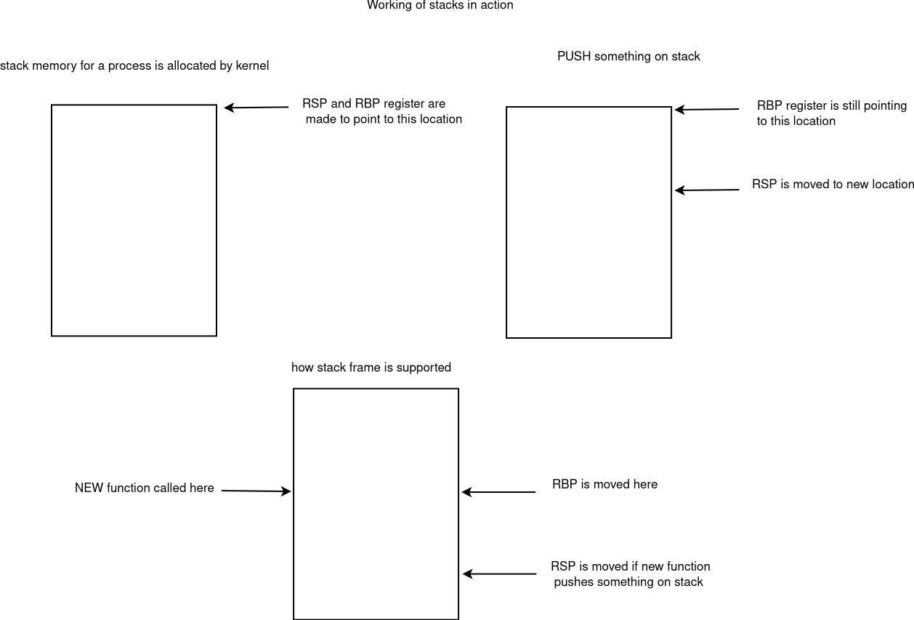

# Data types

## Number
basically we handle these bits type  
- Integers  
    - bits  
        - 8 bits  
        - 16 bits  
        - 32 bits  
        - 64 bits  
    - unsigned nos with similar bit size  

    - unsigned char is just int of 8 bits(char is compiler dependent so cant be relied upon may be unsigned char or signed char internally)  
    [byte data type in c/](https://stackoverflow.com/questions/20024690/is-there-byte-data-type-in-c)  
    - char  
    - short  
    - int  
    - long  
    - long long  

    - all unsigned counter part just starts with unsigned keyword  
    - unsigned short  
    - unsigned int  
    - unsigned long  
    - unsigned long long  
    
usually 64 bit processor will fetch 32/64 bits but they can work on 8/16/32/64 bytes. 

## C standard for integer sizes
standard has only defined minimum size for them   
short and int = min 16 bit  
long = min 32 bit  
long long = min 64 bit  
  

## int and char platform dependency
**int**  
so older hardwares might have say 16 bit processor so int will be 16 bit only there are when compiler generates code for that platform we get 16 bit int there, it is good for portability but it becomes a problem when we want that int should be a fixed width so that overflows etc should not happen so stdint.h was created  

**char**  
char is platform dependent  
char
    - unsigned char
    - signed char

some platform make char as unsigned char and some as signed char  
this is problem for portability as we might not know what type of char is available for us  

```c
//now this may work on platform with unsigned char
//but on signed char platform we can't go beyond 128 so we wrap the char c = -1 is what we will get  
char c = 255;
//to overcome this problem we see many places int being used or returned for portability and then converted to signed/unsigned char
```

```c
//EOF is marked as end of file and EOF = -1
//but say we have unsigned char type we can never represent -1 (only 0 to 255 is possible)
//so this is tackled by returning int 
//getchar() returns int

//now EOF = -1 and if we try to return getchar() in a char type for a platform with unsigned char we will never get -1 and loop will run infinitely
char c;
while((c = getchar()) != EOF){

}

```

so if you are taking min size as consideration program will be portable to any platform  
[A good read on platform dependency on integer types](https://softwareengineering.stackexchange.com/questions/400379/why-arent-the-platform-specific-integer-types-in-c-and-c-short-int-long-d)  
[using fixed with size of integers](https://stackoverflow.com/questions/13413521/is-there-any-reason-not-to-use-fixed-width-integer-types-e-g-uint8-t)  
[What is the size of an integer in a 64-bit computer?](https://www.quora.com/What-is-the-size-of-an-integer-in-a-64-bit-computer)  

since there were platform dependency for all integer types c came out with header stdint.h which will typedef underlying type to guarantee some assumptions  

## stdint.h and inttypes.h  
1. The header file on a system that uses a 32-bit int could define int32_t as an alias for int. A different system, one with a 16-bit int and a 32-bit long, could define the same name, int32_t, as an alias for int. Then, when you write a program using int32_t as a type and include the stdint.h header file, the compiler will substitute int or long for the type in a manner appropriate for your particular system.
The alternative names we just discussed are examples of exact-width integer types; int32_t is exactly 32 bits, no less or no more. It’s possible the underlying system might not support these choices, so the exact-width integer types are optional.  

2. set of names promises the type is at least big enough to meet the specification and that no other type that can do the job is smaller. These types are called minimum width types. For example, int_least8_t
3. C11 define a set of types that will allow the fastest computations. These are called the fastest minimum width types. 
4. or some programmers, only the biggest possible integer type on a system will do; intmax_t stands for that type, a type that can hold any valid signed integer value. Similarly, uintmax_t stands for the largest available unsigned type.  

printf() requires specific specifiers for particular types. So what do you do to display an int32_t value when it might require a %d specifier for one definition and an %ld for another? The current standard provides some string macros  to be used to display the portable types. For example,
the inttypes.h header file will define PRId32 as a string representing the appropriate specifier (d or l, for instance) for a 32-bit signed value. The inttypes.h header file includes stdint.h, so the program only needs to include inttypes.h.  

printf("x = %" PRId32 "\n", x);  
printf("x = %" "d" "\n", x);  
But C combines consecutive quoted strings into a single quoted string, making the line this:  
printf("x = %d\n", x);  


## Integer Overflow  
The unsigned integer j is acting like a car’s odometer. When it reaches its maximum value,
it starts over at the beginning. The integer i acts similarly. The main difference is that the unsigned int variable j, like an odometer, begins at 0, but the int variable i begins at –2147483648. Notice that you are not informed that i has exceeded (overflowed) its maximum value. You would have to include your own programming to keep tabs on that.
The behavior described here is mandated by the rules of C for unsigned types. The standard doesn’t define how signed types should behave. The behavior shown here is typical, but you could encounter something different

//TODO: how does this work at byte level

# FLOAT/DOUBLE

[IEEE-754 representation visually](http://bartaz.github.io/ieee754-visualization/)
we can visualize the floating point from here, even 0 and 1 can be changed with mouse for new value visualization

- Real Nos
    - float
        - 32 bits
    - double
        - 64 bits

How floats and double are stored in memory  

## Floating-Point Overflow and Underflow  
This is an example of overflow—when a calculation leads to a number too
large to be expressed. The behavior for this case used to be undefined, but now C specifies that toobig gets assigned a special value that stands for infinity and that printf() displays either inf or infinity (or some variation on that theme) for the value.  
There will be a number that has the smallest possible exponent and also the smallest value that still uses all the bits available to represent the mantissa. This will be the smallest number that still is represented
to the full precision available to a float value. Now divide it by 2. Normally, this reduces the exponent, but the exponent already is as small as it can get. So, instead, the computer moves the bits in the mantissa over, vacating the first position and losing the last binary digit. This situation is called underflow, and C refers to floating-point values that have lost the full precision of the type as subnormal. If you divide by a large enough value, you lose all the digits and are left with 0. The C library now provides functions that let you check whether your computations are producing subnormal values.  

NaN, or not-a-number  
asin() function a value, and it returns the angle that has that value as its sine. But the value of a sine can’t be greater than 1, so the function is undefined for values in excess of 1. In such cases, the function returns the NaN value, which printf() displays as nan, NaN, or something similar.  


## printing formatted output using printf  
format specifiers in C
--------------------->
%c	Character	char unsigned char  
%d	Signed Integer	short unsigned short int long  
%e or %E	Scientific notation of float values	float double  
%f	Floating point	float  
%.2f float with 2 digit after decimal  
%g or %G	Similar as %e or %E	float double  
%hi	Signed Integer(Short)	short  
%hu	Unsigned Integer(Short)	unsigned short  
%i	Signed Integer	short unsigned short int long  
%l or %ld or %li	Signed Integer	long  
%lf	Floating point	double  
%Lf	Floating point	long double  
%lu	Unsigned integer	unsigned int unsigned long  
%lli, %lld	Signed Integer	long long  
%llu	Unsigned Integer	unsigned long long  
%o	Octal representation of Integer.	short unsigned short int unsigned int long  
%p	Address of pointer to void void *	void *  
%s	String	char *  
%u	Unsigned Integer	unsigned int unsigned long  
	it can also be used for printing address as they are non negative nos  
%x or %X	Hexadecimal representation of Unsigned Integer	short unsigned short int unsigned int long  
%n	Prints nothing	 
%%	Prints % character   

%+10.2f prints 10 digits total and 2 digits after decimal with right justified  

```c
#include <stdio.h>
int main(){
	float a = 1234.342;
	printf("*%+10.2d*\n",a);
}
```

## const data type 
a variable/data marked as const can't be modified while program is running

## octal and hexadecimal   
octal = starts with 0 like 028  
hex = starts with 0x like 0xAE35  
To display an integer in hexadecimal, use %x. If you want to display the C prefixes, you can use specifiers %#o, %#x, and %#X to generate the 0, 0x, and 0X prefixes respectively  


Questions:-

### what is **stdint.h**
since different compilers and different machines 8 bit, 16,32 and 64 bits machine have different sizes for all the integer types this header tries to give names which will be almost same on all platforms and compiler if that size is available
- uint8_t = this is used by bytes types most of the time
- int32_t = for guaranteed 32 bit int
- uint32_t = for guaranteed unsigned 32 bit int
- uintptr_t = memory is address in form of integers since for compilers it is of type int* (say) i.e. pointer type we can't do all possible arithmetics and other operations which are possible on integers so uintptr_t was created to convert int* type to actual integer on which we can do all sorts of operation of integer  

### what is **size_t** and why it has come
so sizes can not be negative so it is better to have unsigned type for size what better way to typedef the biggest unsigned int type as size_t on that platform     

Ideas:-
This naming convention from rust looks to me best can be typedefed in c  
i8,i16,i32,i64,i128 => signed ones  
u8,u16,u32,u64,u128 => unsigned ones  

## what is a variable at hardware level

for simplicity if we think some address from RAM is stored in one of the registers say RSP   
then we can locate any other address just by adding a no to it  
RSP+1, RSP+10, RSP+200 etc..

so a variable at low level is pretty much something/data holded at an address  
but we don't get any way to share this address   
so variable say x then only x can manipulate data at that address  

pointer is another kind of variables which can share the addresses  
so more than 1 pointer can access same memory  
hence pointer is pretty much developed for sharing of data  

we can have struct, union, enum at high level to point to data at some memory location also  

## How stack and stack frames works at hardware level in x64

  

think of these 2 scenarios in c  
TODO: this is not valid for x64 to be modified - only RSP alone does the job
a function call = hello()  defined as void hello(){}  
so all local variables of functions and some args (as defined by abi of OS/hardware) are stored on stack memory   
just as stack is created RBP and RSP registers point to starting of stack  
once something is pushed on stack RSP is moved to point to next memory location  
when function returns we move RSP back to RBP location  

and another fn call = greet() defined as void greet(){hello();}  
so here greet will work same as hello() function before but  
once hello is called new stack is to be created these small stacks of functions are called as   
stack frames and entire stack frame memory can be seen as stack  

now before moving RSP when hello() is called we move RBP at this new call location of hello() so  
that when hello() returns we can come back to to stack frame of greet()  
but new problem arises as since RBP was modified how we will know where greet() stack frame was started  
so somehow we have to push the RBP address before incrementing RSP when hello() was called  

see in assembly   

greet:
    
hello:
    push %rbp    #push rbp address first
    # do something else


## data type conversion say an int to short etc. 
TODO: is this correct ?
so these type of conversions are really supported by hardware so they are not specific to any language but depends on underlying processor  

References:-
[c data types from wikipedia](https://en.wikipedia.org/wiki/C_data_types)  
[What is difference between global and static variables in C ?](http://codingstreet.com/c-basic-questions/what-is-difference-between-global-and-static-variables-in-c/)    
TODO: put intel manual and amd64 manual link 

Book:-  
C Primer plus 6th edition
