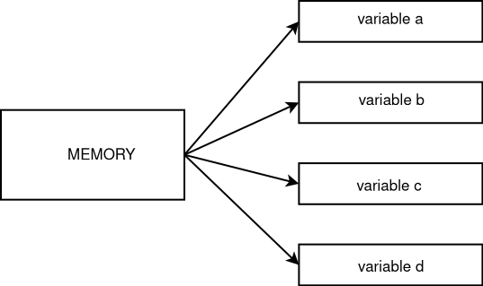

# Dynamic memory

## new and delete
new operator allocates memory, and delete frees memory allocated by new.  

By default, dynamically allocated objects are default initialized,
which means that objects of built-in or compound type have undefined value; objects
of class type are initialized by their default constructor:  
```cpp
string *ps = new string;  // initialized to empty string
int *pi = new int;        // pi points to an uninitialized int
```

**primary types allocation/deallocation**

```cpp
#include <iostream>
#include <cassert>

using namespace std;

int main(){
    //allocate memory using new
    int *a = new int;
    int b = 10;
    a = &b;
    assert(*a == 10);
    //free memory
    delete a;
}
```

**array allocation/deallocation**
```cpp
#include <iostream>
#include <cassert>

using namespace std;

int main(){
    //allocate array using new
    int *a = new int[10];
    for (int i = 0; i < 10; i++) {
        a[i] = 10;
    }
    assert(a[9] == 10);
    //free memory
    delete[] a;
}
```

## smart pointers
smart pointer  
works with dynamic memory   
can mimic like normal pointer with deref * etc  
automatically frees the memory  

### shared_pointer and weak_pointer

**shared pointer**



shared pointers (multiple variable) can have access to same memory region  
once all the references to shared memory goes out of scope memory will be cleaned up automatically  

A default initialized smart pointer holds a null pointer  
Dereferencing a smart pointer returns the object to which the pointer points.  

**basic shared_pointer**

```cpp
#include <memory>
#include <cassert>

using namespace std;

int main(){
    shared_ptr<int> sharedPtr(new int(10));
    //check value by dereff
    assert(*sharedPtr == 10);
    //sharedPointer variable goes out of scope memory cleaned up automatically no delete required 
}
```

**shared_pointer multiple references**
```cpp
#include <memory>
#include <cassert>

using namespace std;

int main(){
    shared_ptr<int> sharedPtr(new int(10));
    //create another shared_pointer since no memory is pointed it will point to nullptr
    shared_ptr<int> sharedPtr1;
    //use assignment to point to previous sharedPtr
    sharedPtr1 = sharedPtr;
    //check if two references available to same memory
    assert(sharedPtr1.use_count() == 2);
    //change memory from second sharedPtr variable
    *sharedPtr1 = 20;
    //check if effect is on sharedPtr also
    assert(*sharedPtr == 20);
}
```

**make_shared**
```cpp
#include <memory>
#include <cassert>

using namespace std;

int main(){
    //make_shared() will automatically allocate dynamic memory for you
    shared_ptr<int> sharedPtr = make_shared<int>(10);

    //check value
    assert(*sharedPtr == 10);
}
```

**weak pointer**  
we can create weak pointer to a memory region like shared pointer but weak pointer will not increase references so once all shred references are gone memory can be cleaned up  

so there may be be a weak pointer still exists but it may not always guaranteed to have actual underlying memory, then we have to check that if that memory is still there somehow if so then do operation


### unique_pointer