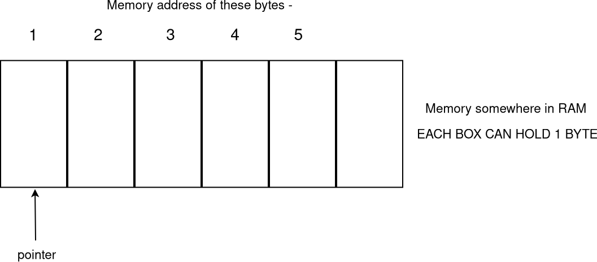

# Pointer

TODO: read the intel software manual chapter 4.3 and amd64 manual chapter 2.3 to know about pointer at hardware level

i am interested in 64 bit mode only  
pointer will be address represented by 64 bits field  
now how many GB 64 bits can address - 2^64 bytes addresses

each byte in RAM is having a fixed address  
pointer can store this address (for any byte)  
adding 1 to pointer logically gives next byte address and similarly subtracting will give previous byte address  
no byte has address 0 in actual hardware so this was used as null/nil implementation

## Pointer working on type
**getting address**   
getting address/pointer by hardcoding it is not viable so all programming languages give a way to get address of already allocated memory somewhere  
usually this is done using &  

**deref**  
pointer can address a byte  
if we give type to pointer now we know the size in bytes also  
manipulating underlying memory can be done easily

say e.g.

i have address 61 in pointer  
and pointer type is int - now we know int has 4 bytes  
so deref this pointer then i have to change values at address 61,62,63 and 64 also  

## pointer arithmetic

**addition and sub on pointer known as pointer arithmetic**  
as address comes 1 after other - say 61 then 62,63,64 and so on...  
we can implement + on pointer as getting the next addresses  

61 + 3 = 64 like this  
61 - 1 = 60  

how this can be done ??  
simplest idea is convert pointer to int type and since all arithmetics can be done on integer types voila  
only problem is that pointer are 4 bytes or 8 bytes depending on 32/64 bit platform  

so we have special int type uint_ptr which is platform dependent based on 32/64 bit  

## null pointers

some languages allow pointer to be declared and later to be assigned to some address  
this is a big problem sometimes, how ??

say i declared and not assigned any address to that pointer  
somewhere memory will be allocated 8 bytes in 64 bit machine  
this 8 byte memory may hold any bit pattern at this location (usually called as garbage value)

now when we will deref the pointer it will treat as correct address and will change the value at that location  
which was not desirable  
now there is no way for compiler to know if this address is valid one or not .
so people came with an idea named null  
this null will have predefined address usually 0 (since 0 is not any valid hardware address)  
now when compiler sees bit pattern for null it knows i should not access memory at that location and complains   
