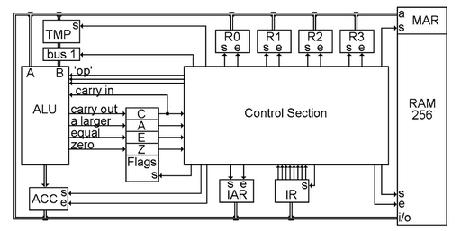

# Hardware

Processor, RAM, BUS, IO Bus

## How does processor and RAM carry out most of the tasks using BUS 

## RAM 

MAR - memory address register  
set MAR value and access that RAM location  
address - value kept in MAR  

## Processor

**registers**  
register faster value access than RAM   
TODO: why register is fast because closer to processor so electricity travel time is smaller compared to RAM  

**ALU**  
takes two registers and do operation   
like +, -, *, /, %, <<, >> etc...  
so since operations are more than 1  
assign a number corresponding to each operation so that ALU can know  
which arithmetic operation is to be done - this no is called OPCODE  

e.g.  
for adding 10 + 10  
one 10 in rax and one in rbx  
ADD %rax %rbx  => opcode register register  

**control section**  
it is not very useful from software perspective  
sync all operation happening in hardware  
like a byte kept on bus should be changing only some particular register this will be ensured by control section  

**IR**   
IR register keeps the current instruction being executed  

**IAR**   
IAR register keeps the address of next instruction to be executed  

## BUS
bus is just group of wires which takes electricity from one place to another - taking electricity means taking bytes  
all the things from ram, register, alu etc.. are connected to bus  
so that they can give/take byte to/from another place  

Reference:
Book - But how Do it Know?, The Basic Principles of Computers for Everyone – J. Clark Scott   
[Intel CPU Manual - IA32 and x86_64 ](https://software.intel.com/content/www/us/en/develop/articles/intel-sdm.html)  
[AMD64 manual](https://developer.amd.com/resources/developer-guides-manuals/) - look for AMD64 Architecture Programmer’s Manual Volumes 1-5  

youtube channel - [Luis Ceze channel](https://www.youtube.com/channel/UCmf3tLU4WzOnriEQXa638Bw)  

